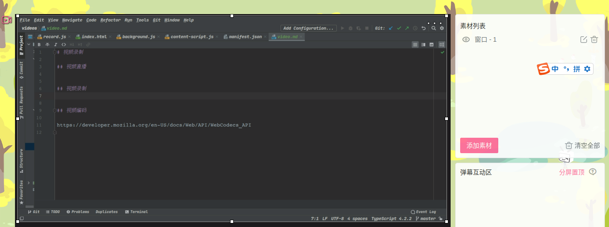
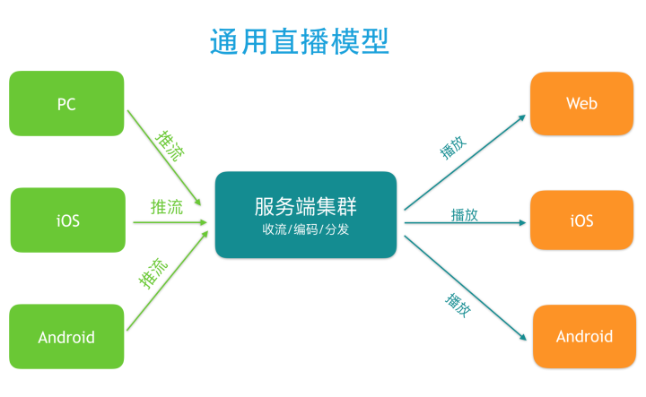
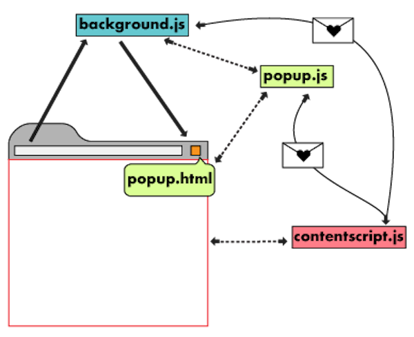

# 视频

## 视频直播技术

一个完整的直播系统大致包含这几个环节: 采集, 处理, 编码, 传输, 解码和渲染.  在两端传输的过程中再加上一个服务端处理. 
大致的模型如下:

直播协议：http://www.samirchen.com/ios-rtmp-vs-hls

[B站视频直播](https://www.livevideostack.cn/news/practical-application-of-hls-and-decentralized-p2p-in-live-broadcast-at-station-b/)

## 视频录制

## Chrome Extension

Chrome Extension 包含的内容:

manifest:
manifest 是唯一必须具有特定文件名的文件: manifest.json. 它还必须位于扩展程序的根目录中. manifest 记录了重要的metadata, resources, 
permissions, 并标识哪些文件在后台和页面上运行.

service worker:
处理和监听浏览器事件. 有多种类型的事件, 例如导航到新页面, 删除书签或关闭选项卡. **可以使用 Chrome 的所有API, 但不能直接与网页内容交互(这
是内容脚本的工作)**. 一个 Extension 只能包含一个 service worker. 如果要导入其他代码, 需要将 "type" 声明为 "module". 

content scripts:
在网页上下文中执行 Javascript. 他们还可以读取和修改他们注入的页面的 DOM. content scripts 只能使用 Chrome API 的一个子集, 但可以通过
与 service worker 交换消息来间接访问其余部分.

popup and other pages:
扩展可以包含各种 HTML 文件, 例如 popup page, option page 和 other html page. 所有这些页面都可以访问 Chrome API.

messaging: https://developer.chrome.com/docs/extensions/mv3/messaging/

Worker: https://developer.chrome.com/docs/extensions/mv3/service_workers/

content: https://developer.chrome.com/docs/extensions/mv3/content_scripts/

## 视频编码

网络编解码器 API: 

https://developer.mozilla.org/en-US/docs/Web/API/WebCodecs_API

https://developer.chrome.com/articles/webcodecs/

https://developer.mozilla.org/en-US/docs/Web/API/MediaStreamTrackProcessor

Chrome Extension: 

https://developer.chrome.com/docs/extensions/

文章: 

https://github.com/f2e-journey/xueqianban/issues/61

